# Tabiato 旅跡 by GroupName

**Team:** Tan Ee Xin, Teh Jia Qii, Chen Ling Yau, Teoh Ming Xun

**Problem Statement:** Travel Planner

**Video Presentation:** https://youtu.be/bQG9s8NzBco

**Presentation Slides:** https://docs.google.com/presentation/d/1Z6h0JZJs1orTCc-liKkpJXiwxuKugAiY/edit?usp=drivesdk&ouid=110257129014251685523&rtpof=true&sd=true

**UI Prototype (Figma):** https://www.figma.com/design/FTZudZVL2X3PsmlvoPtUJv/Codenection-HACKATHON

---

> ### Four people go on the same trip and come home with four separate camera rolls.
>
> Two months later nobody remembers what that noodle place was called, who paid for what, or
> which day was the good one. The trip happened. The record of it did not.
>
> **Tabiato is where a trip goes after it ends.** One shared map instead of four camera rolls.
> Every place you stopped at, holding what you spent, how you rated it, and what the people you
> travelled with said about it. Then an AI reads all of it and writes the trip back to you —
> including things about yourself you never noticed.
>
> And because it now knows which places you gave five stars and where your money actually goes,
> the next trip it helps you plan is not being written for a stranger.

**Our reading of the problem statement.** The hardest part of travel planning is not the plan.
It is that nothing you learn from one trip ever reaches the next one, and that the most valuable
part of a trip — what actually happened — is thrown away the moment it ends. So we built the
memory first and let planning fall out of it. A planner that has read your last three trips is a
better planner than one staring at a blank form.

> **旅跡** — 旅 *journey* + 跡 *trace*. The marks a trip leaves behind.

---

## 1. Project Overview

### The Problem

**1. The record of a trip is destroyed by default.**
Photos go to the camera roll. The bill goes to a group chat and scrolls away. The restaurant name
was in someone's story that expired. The rating exists only as *"that place was so good"*, said
out loud once. Nothing is connected to anything, so a trip survives as a folder of images with no
meaning attached.

**2. Group trips lose the most and have the worst tools.**
Four people photograph the same five days from four angles and never merge them. A shared album
gets you everyone's photos in one pile; it does not get you *the trip*. Who paid for the taxi,
which of the two temples everyone actually liked, why day three went wrong — that lives in four
heads and dies there.

**3. Remembering is a manual chore, so nobody does it.**
Travel journals exist and get abandoned, because typing an entry after a day of walking is the
last thing anyone wants to do. Any system that depends on the user writing things up loses to
exhaustion.

**4. Every trip starts from zero.**
No app remembers that you rate slow mornings higher than packed days, that you consistently
overspend on food, or that the day you crammed six stops into was the day you enjoyed least. Next
year you open a blank itinerary and make the same mistakes.

**Stakeholders.** Primary users are **students and young adults in Malaysia and the wider SEA
region taking short, budget-conscious group trips** — 3 to 7 days, 2 to 5 people, splitting costs,
shooting everything on a phone. Secondary: the friends and family following along, and travel
creators whose audiences want the real itinerary and the real cost rather than a highlight reel.

**What exists today, and where it stops.**

| Existing solution | What it does well | Where it stops |
| --- | --- | --- |
| **Google Photos** (shared albums, map view) | Reliable backup, photos placed on a map from EXIF GPS, albums shared with a group | It stores *images*, not *a trip*. There is no concept of a place you visited that holds what you spent, how you rated it, or what your friends said there. Nothing it stores is ever used to help you do anything. |
| **Wanderlog** (collaborative planner) | Solid day-by-day itinerary building, collaborative editing, budget fields | The relationship ends the moment the trip starts. It never learns what actually happened, so it cannot tell you your plan was too dense — and next year it starts blank again. |

One app remembers photos and understands nothing. The other understands planning and remembers
nothing. **The gap between them is the entire product.**

### Our Solution

Tabiato turns a trip into **structured, shared memory**, then uses that memory to plan the next
one.

The unit is not a photo. The unit is **a place you went**. You upload photos; Tabiato reads their
GPS and timestamp and groups them into the places you actually stopped at. Each place becomes a
record holding its photos, what was spent there, your rating, your notes, and the comments of
everyone who was with you. That record is what the AI reads, what your friends contribute to, and
what the next itinerary is built from.

---

## 2. How It Actually Works

One loop. Each stage writes the data the next stage reads.

### Stage 0 — The promise, in three screens

New users see three cards before anything else, because the idea only works if you get it in ten
seconds.

<table>
<tr>
<td width="33%">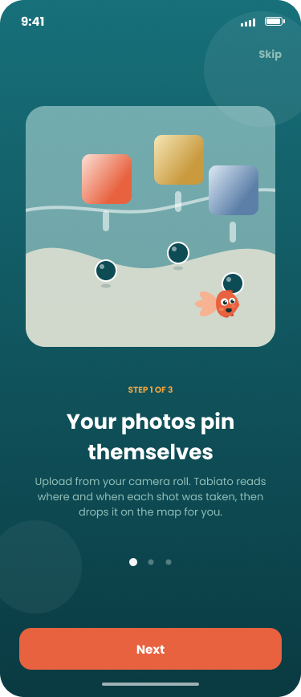</td>
<td width="33%">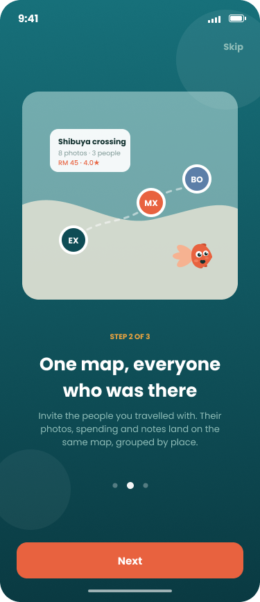</td>
<td width="33%">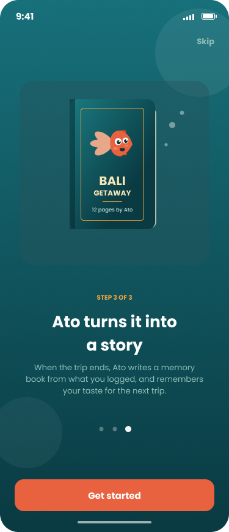</td>
</tr>
<tr>
<td valign="top"><b>Your photos pin themselves.</b> No typing — upload, and the app reads where
and when each shot was taken.</td>
<td valign="top"><b>One map, everyone who was there.</b> The people you travelled with add to the
same map, grouped into the same places.</td>
<td valign="top"><b>Ato turns it into a story.</b> When the trip ends the AI writes it up, and
remembers your taste for next time.</td>
</tr>
</table>

### Stage 1 — Home is memory, not planning

<table>
<tr>
<td width="25%">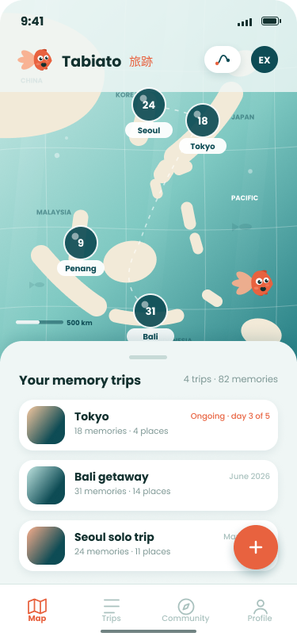</td>
<td width="25%">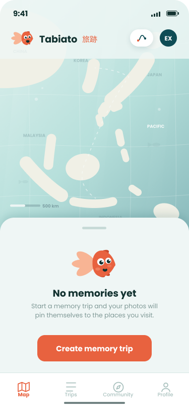</td>
<td width="25%">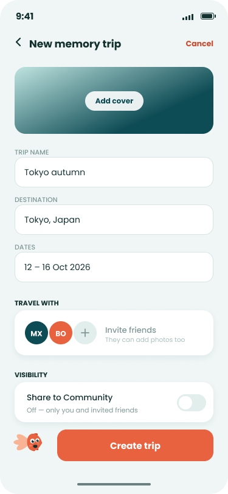</td>
<td width="25%">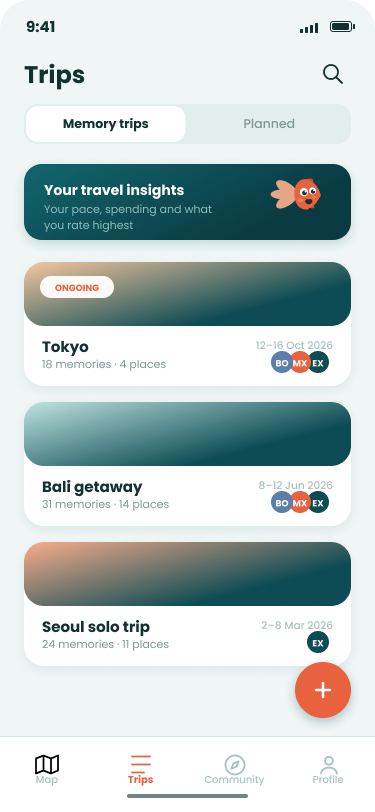</td>
</tr>
<tr>
<td valign="top"><b>Home.</b> Every trip you have recorded, as a pin.</td>
<td valign="top"><b>Empty state.</b> One button, no form.</td>
<td valign="top"><b>Create a memory trip.</b> Name, place, dates, who is coming, and whether it is
public. Thirty seconds, then you start recording.</td>
<td valign="top"><b>Trips.</b> Memory trips and planned trips as two tabs of one list — a plan
becomes a memory trip the moment you press Start.</td>
</tr>
</table>

**Opening the app shows you where you have been.** Every trip you have recorded is a pin, with
the number of memories inside it. This is a deliberate inversion: most travel apps open on a
search box asking where you want to go. Tabiato opens on where you have already been, because
that is the asset everything else is built from.

The planner is the small button in the top-right corner. That placement is the product argument
expressed as a design decision.

**The empty state matters too.** A brand-new account sees the map dimmed and a single button —
*Create memory trip* — so a new user's first action is to start a record, not fill in a form.

### Stage 2 — Recording is three taps and never a chore

This is where journalling apps lose their users, so it is what we designed hardest.

<table>
<tr>
<td width="25%">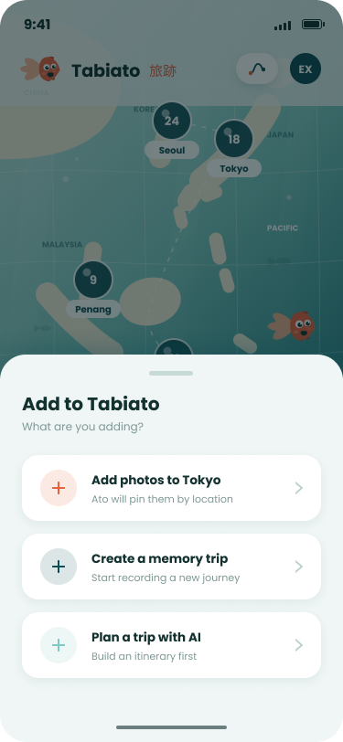</td>
<td width="25%">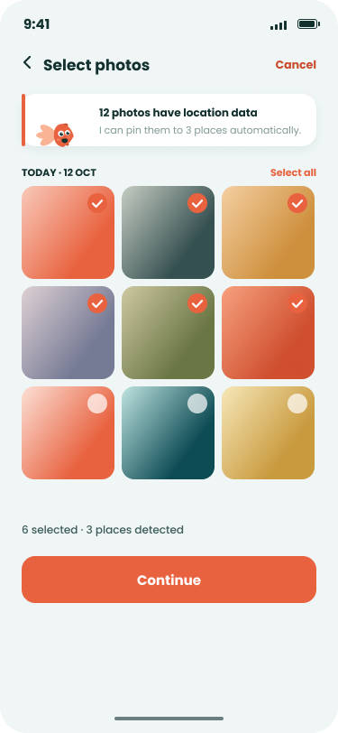</td>
<td width="25%">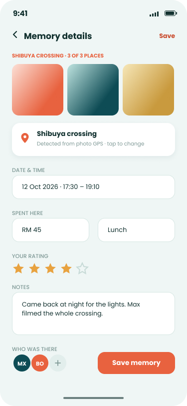</td>
<td width="25%">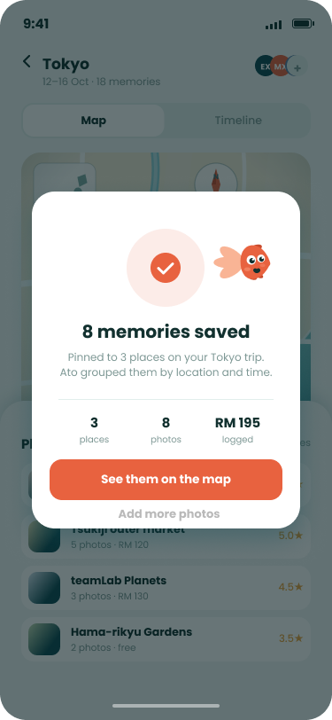</td>
</tr>
<tr>
<td valign="top"><b>1. Tap ＋.</b> Add photos to the trip you are on, start a new memory trip, or
— optionally — plan one.</td>
<td valign="top"><b>2. Select photos.</b> Ato says up front: <i>"12 photos have location data — I
can pin them to 3 places automatically."</i> You learn what the app will do for you before doing
any work yourself.</td>
<td valign="top"><b>3. Confirm.</b> Place already detected from GPS. Spend, rating and notes are
optional attachments, not required fields.</td>
<td valign="top"><b>4. Done.</b> 8 memories, 3 places, RM 195 logged — out of one photo selection.</td>
</tr>
</table>

**Three decisions that make this survive real use:**

- **Nothing is mandatory except the photos.** Someone standing in a queue can dump twenty photos
  and walk away; someone on the train home can come back and fill in the rest. The record gets
  built either way.
- **When GPS is missing we ask — we never guess.** A mentor raised this specifically: if location
  services were off, a silently wrong pin puts the wrong day in the wrong place and quietly
  corrupts the story. A photo with no location gets a mandatory manual entry, never a
  nearby-photo guess.
- **The grouping is automatic.** Photos cluster into places by GPS proximity and time, so eight
  photos of one crossing become one place record instead of eight entries.

### Stage 3 — A place, not a photo

<table>
<tr>
<td width="42%">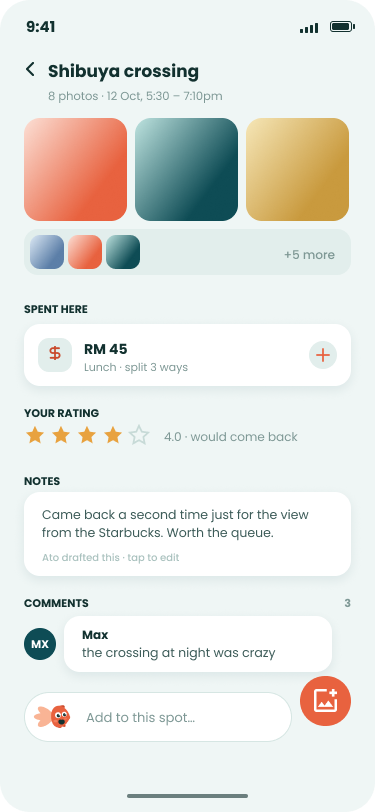</td>
<td width="58%" valign="top">

**This single screen is the whole product.** Everything else exists either to fill it in, or to
read it back out.

- **The photo set** — all eight shots of Shibuya crossing, together, with the time window they
  span.
- **What it cost** — RM 45, lunch, split three ways. Attached to the *place*, which is what makes
  a spend-by-location breakdown possible later.
- **Your rating** — 4.0. The signal that drives next-trip personalisation. Yours, not a scraped
  review score.
- **Your notes** — *"Came back a second time just for the view from the Starbucks."* Ato can draft
  these from the photos so writing is never a blank page; you edit rather than compose.
- **Comments from the people who were there** — Max writing *"the crossing at night was crazy"*
  under the photos of that crossing. Not in a group chat that scrolls away. Attached to the place,
  permanently.

A shared photo album gives you the first bullet. Tabiato gives you all five, and it is the other
four that make everything downstream possible.

</td>
</tr>
</table>

### Stage 4 — The same trip, two ways to relive it

<table>
<tr>
<td width="50%">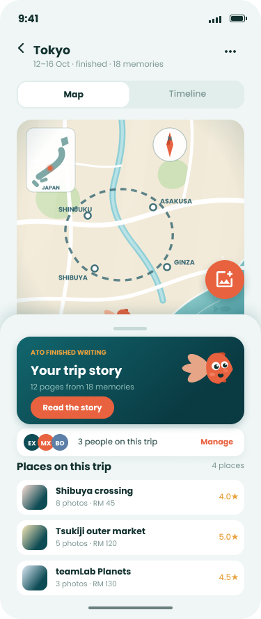</td>
<td width="50%">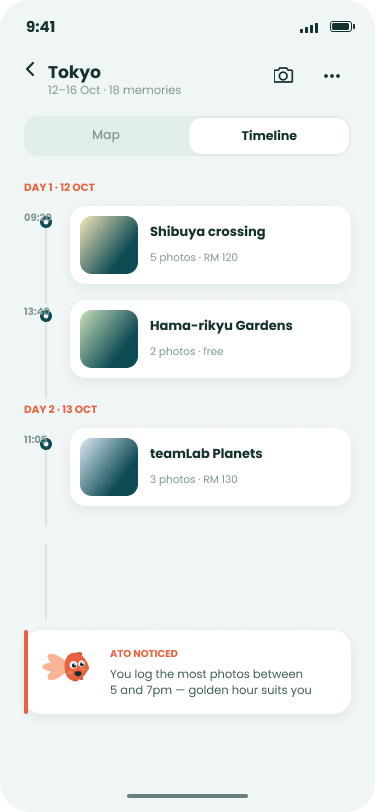</td>
</tr>
<tr>
<td valign="top"><b>Map view</b> — how the trip looked geographically. Photos clustered into
places, on a map styled to look like the app rather than a default embed.</td>
<td valign="top"><b>Timeline view</b> — how it actually unfolded, hour by hour, grouped into
Day 1 / Day 2. Ato adds observations as it reads: <i>"you log the most photos between 5 and 7pm —
golden hour suits you."</i></td>
</tr>
</table>

Both views read the same place records. Neither asks the user to have written anything.

### Stage 5 — Everyone who was there, on one map

<table>
<tr>
<td width="25%">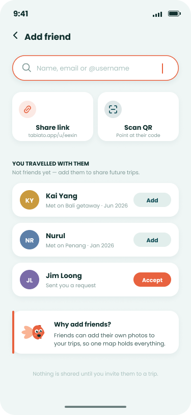</td>
<td width="25%">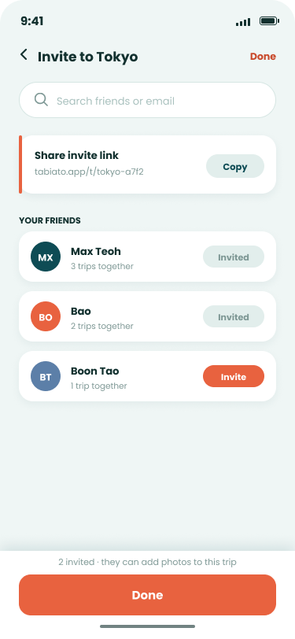</td>
<td width="25%">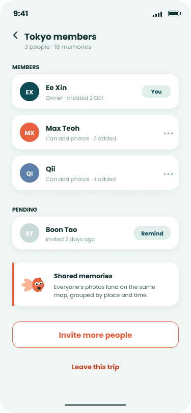</td>
<td width="25%">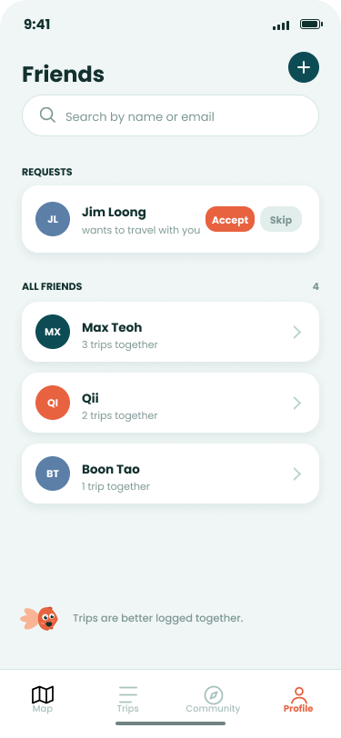</td>
</tr>
<tr>
<td valign="top"><b>Add friends</b> — including people you already travelled with but never
added.</td>
<td valign="top"><b>Invite them to the trip</b> — by name, or a share link for the group chat.</td>
<td valign="top"><b>Members and permissions</b> — the owner controls who can add. <i>Max: 6 added.
Qii: 4 added.</i></td>
<td valign="top"><b>Friends</b> — measured in trips taken together, not follower counts.</td>
</tr>
</table>

**This is the feature we care most about, and the one existing tools handle worst.** When Max
uploads his photos of the same lunch, they do not become a second album — they land on the *same
place record* as yours, next to the same bill and the same rating. Four camera rolls converge
into one account of what happened.

The trip then belongs to all of you. Any member can open it a year later and find the whole thing
intact, including the parts they personally never photographed.

### Stage 6 — The AI reads it back to you

The moment the recording pays off, and the most visible AI output in the product.

<table>
<tr>
<td width="25%">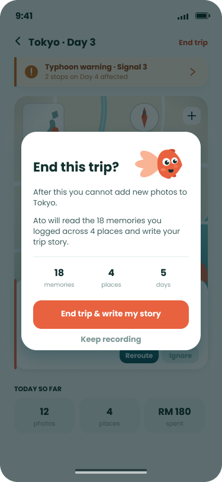</td>
<td width="25%">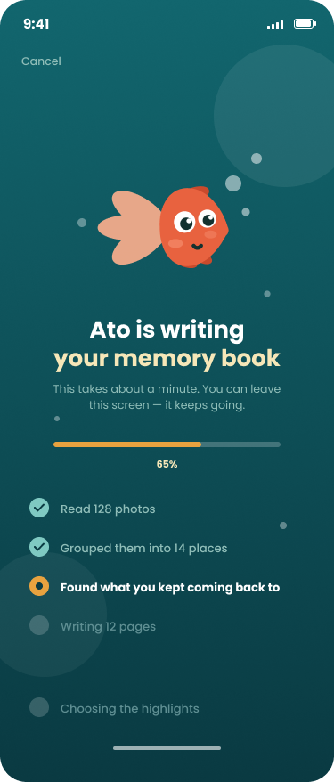</td>
<td width="25%">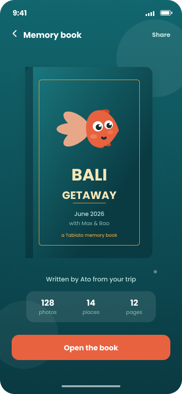</td>
<td width="25%">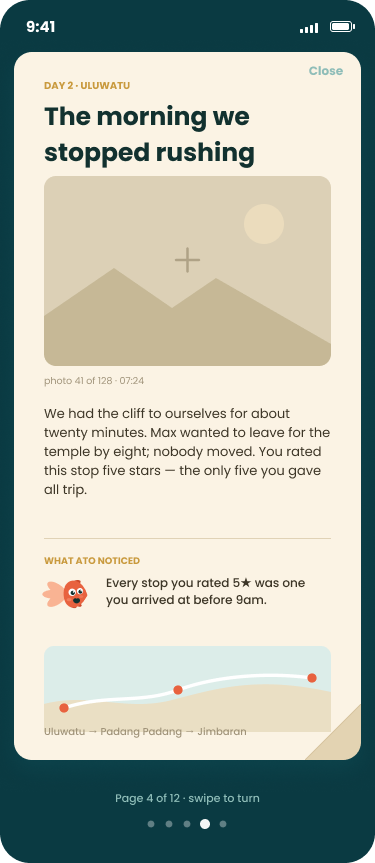</td>
</tr>
<tr>
<td valign="top"><b>End the trip.</b> Explicit, because it closes photo capture — and because it
states the reward: <i>"Ato will read the 18 memories you logged across 4 places and write your
trip story."</i></td>
<td valign="top"><b>Ato writes it.</b> The steps are honest about what is happening: read 128
photos, grouped them into 14 places, <i>found what you kept coming back to</i>.</td>
<td valign="top"><b>The memory book.</b> 12 pages generated from the trip record — not a template
filled with your pictures.</td>
<td valign="top"><b>A page.</b> Photo, narrative, and the part that matters.</td>
</tr>
</table>

**Why this is not just an auto-generated photo album.** Look at what is on that page:

> **What Ato noticed:** *Every stop you rated 5★ was one you arrived at before 9am.*

Nobody told the app that. It read the ratings and timestamps on the place records and found the
pattern. That sentence is only possible because Stage 3 stored a *place* with a rating and a time
rather than a photo with coordinates. A photo book can lay out your pictures beautifully. It
cannot tell you something true about yourself that you had not noticed.

The same engine produces the trip story and the long-run insights:

<table>
<tr>
<td width="50%">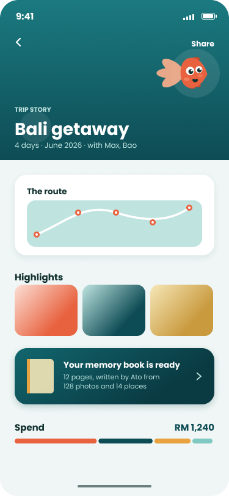</td>
<td width="50%">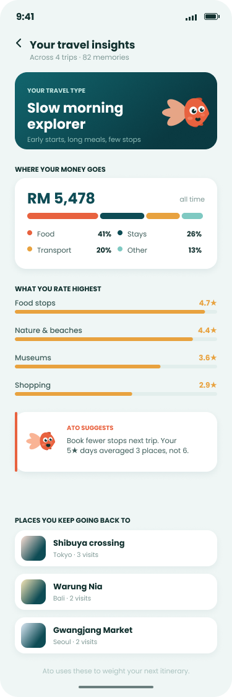</td>
</tr>
<tr>
<td valign="top"><b>Trip story</b> — route, highlights, spend split, and a plain-language verdict
on how the trip went.</td>
<td valign="top"><b>Travel insights</b> — across every trip. Your travel type, where the money
actually goes, what you rate highest, the places you keep returning to. This is the profile that
feeds planning.</td>
</tr>
</table>

### Stage 7 — Finding a memory again, in plain language

<table>
<tr>
<td width="33%">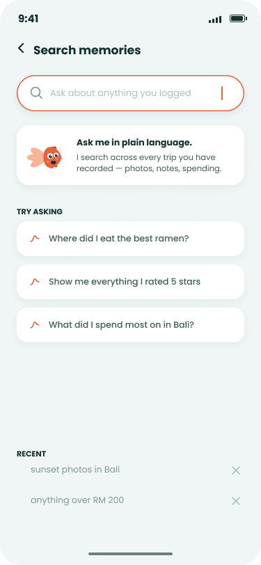</td>
<td width="33%">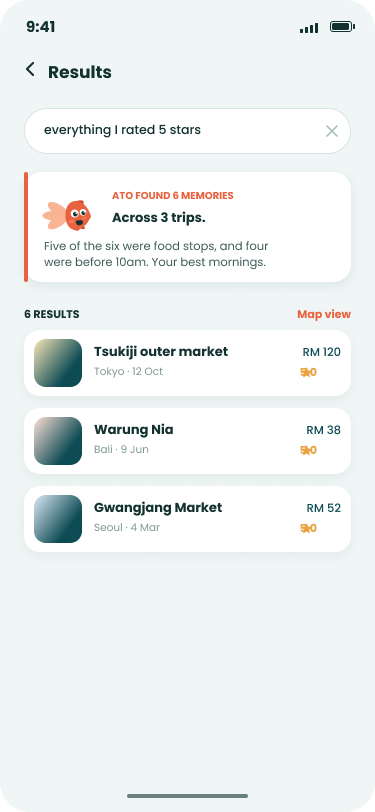</td>
<td width="33%">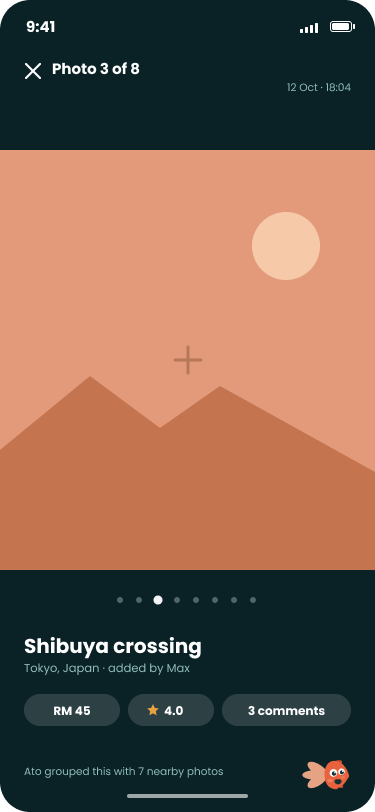</td>
</tr>
<tr>
<td valign="top"><b>Ask anything.</b> "Where did I eat the best ramen?" · "What did I spend most
on in Bali?" · "Places I went with Max."</td>
<td valign="top"><b>Ato answers first, then lists.</b> <i>"6 memories across 3 trips. Five of the
six were food stops, and four were before 10am. Your best mornings."</i></td>
<td valign="top"><b>Open any photo</b> with its place, spend, rating and comments still attached
to it.</td>
</tr>
</table>

This is the direct answer to *"what was that noodle place called?"* — and it only works because
the memory is structured instead of a pile of images.

### Stage 8 — Share it, or keep it

<table>
<tr>
<td width="25%">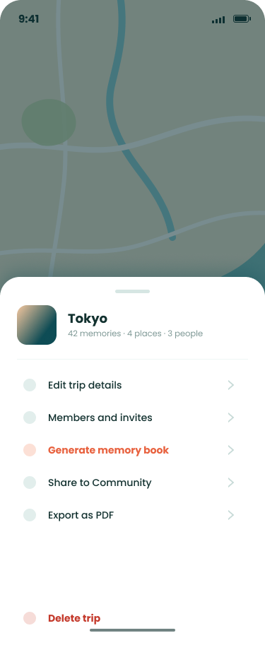</td>
<td width="25%">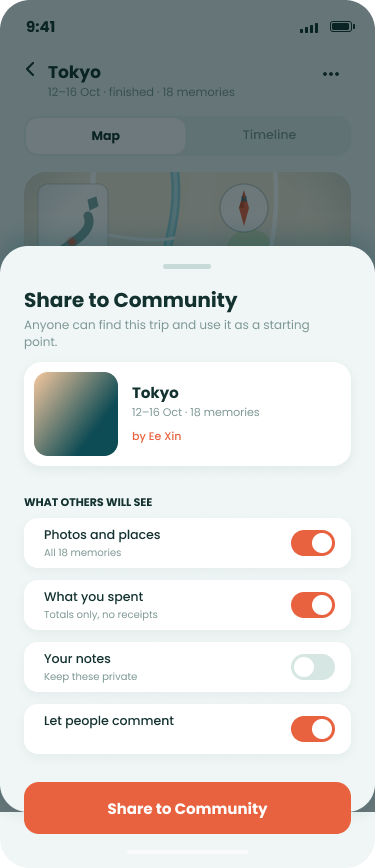</td>
<td width="25%">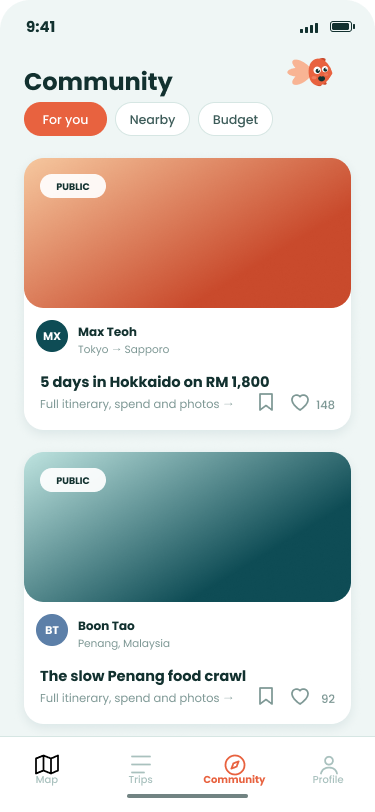</td>
<td width="25%">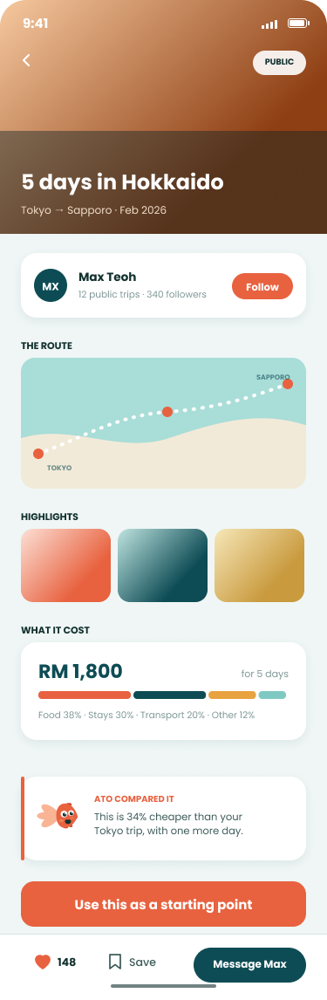</td>
</tr>
<tr>
<td valign="top"><b>Trip options</b> — generate the book, share, export as PDF, or delete.</td>
<td valign="top"><b>Per-field sharing.</b> Photos, spend and comments toggle separately, and
<b>notes default to private</b>. A mentor raised the risk of public travel data exposing people;
this is the answer.</td>
<td valign="top"><b>Community</b> — real trips with the real budget in the headline. <i>"5 days in
Hokkaido on RM 1,800"</i> is what people actually search for.</td>
<td valign="top"><b>A public trip</b> — route, highlights, full cost breakdown, and Ato comparing
it to yours: <i>"34% cheaper than your Tokyo trip, with one more day."</i></td>
</tr>
</table>

### Stage 9 — Only now, the planner

Planning comes last because by this point the app knows something. It is a **supporting feature**,
deliberately placed behind one button on the home screen.

<table>
<tr>
<td width="25%">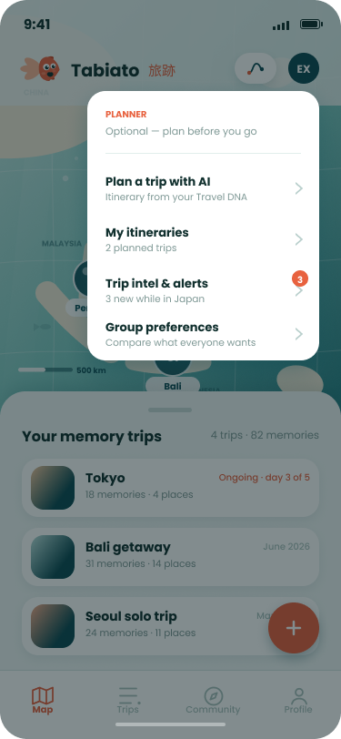</td>
<td width="25%">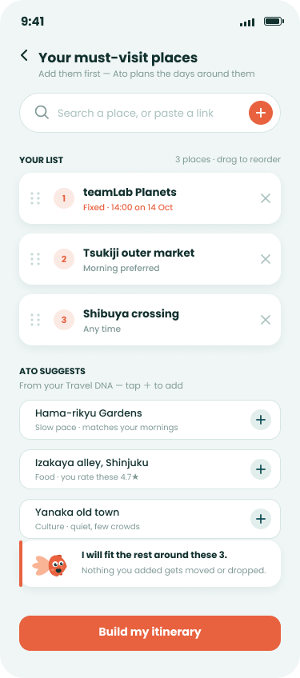</td>
<td width="25%">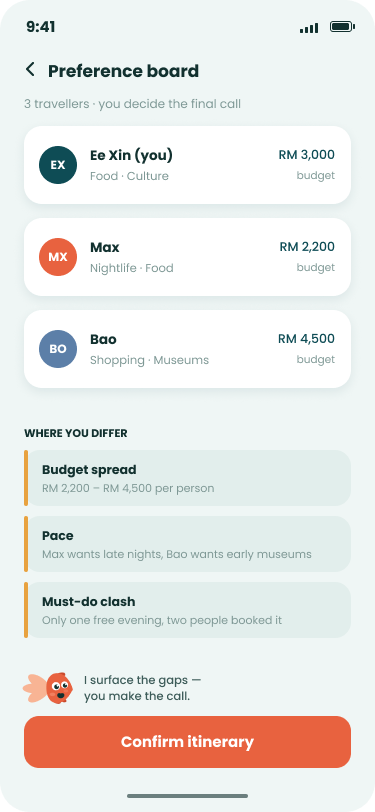</td>
<td width="25%">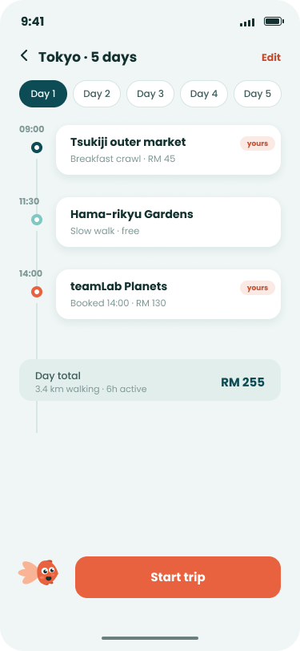</td>
</tr>
<tr>
<td valign="top"><b>The planner lives here</b> — off the main flow, labelled optional.</td>
<td valign="top"><b>Your list comes first.</b> You add the places you already know you want; Ato
promises <i>"I will fit the rest around these 3. Nothing you added gets moved or dropped."</i></td>
<td valign="top"><b>Group preferences</b> — everyone's budget and style side by side with the
conflicts named. The leader decides; the app does not score fairness.</td>
<td valign="top"><b>The itinerary</b> — your stops carry a <b>yours</b> tag. The AI did the
ordering, timing and gap-filling, not the choosing.</td>
</tr>
<tr>
<td valign="top">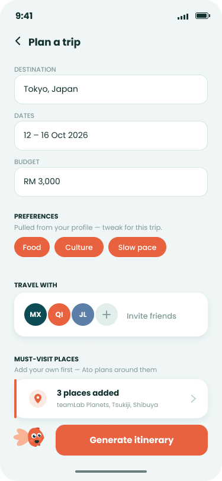</td>
<td valign="top">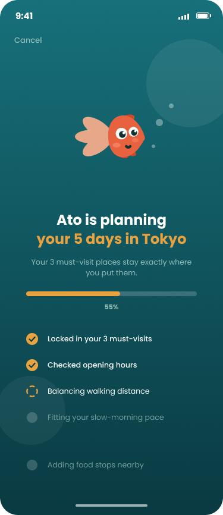</td>
<td valign="top">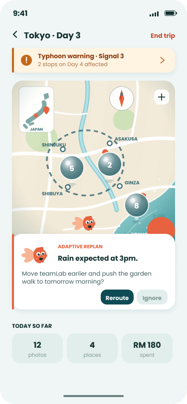</td>
<td valign="top">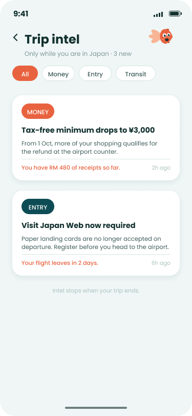</td>
</tr>
<tr>
<td valign="top"><b>Plan a trip.</b> Preferences are pre-filled from what the app already learned
about you, and the must-visit list sits above the button.</td>
<td valign="top"><b>Generating.</b> The progress list states the constraint out loud: <i>"Locked
in your 3 must-visits"</i> before anything else happens.</td>
<td valign="top"><b>During the trip.</b> The live map, today's totals, and any replan Ato is
proposing — all in one screen you can check while walking.</td>
<td valign="top"><b>Trip intel.</b> Tax-refund changes, entry-rule changes, transit closures —
filtered to your destination and dates, and only while you are there.</td>
</tr>
</table>

And during the trip, alerts are matched against *your* stops rather than broadcast:

<table>
<tr>
<td width="42%">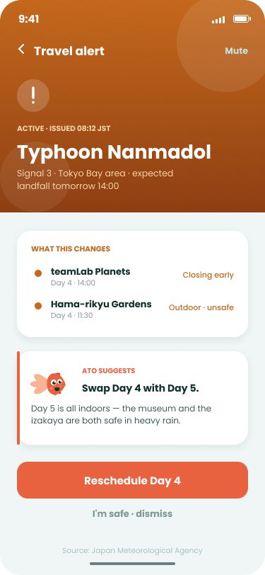</td>
<td width="58%" valign="top">

A typhoon warning is a news item. This is a decision:

- **What this changes** — teamLab Planets on Day 4 closes early; Hama-rikyu Gardens on Day 4 is
  outdoors and unsafe. It names *your* two affected stops, not the weather in general.
- **Ato suggests** — swap Day 4 with Day 5, *because Day 5 is all indoors*.
- **One button** reschedules it.

The intel feed behind it (tax-refund changes, entry-rule changes, transit closures) is filtered to
your destination and dates, and every item ends with a line tying it back to your own trip:
*"You have RM 480 of receipts so far."*

</td>
</tr>
</table>

### The rest of the prototype

The screens above carry the argument. These are the ones that make it a product rather than a
demo path — onboarding, the planned-trips tab, and the empty, confirmation and destructive states
that most prototypes skip.

<table>
<tr>
<td width="20%"></td>
<td width="20%">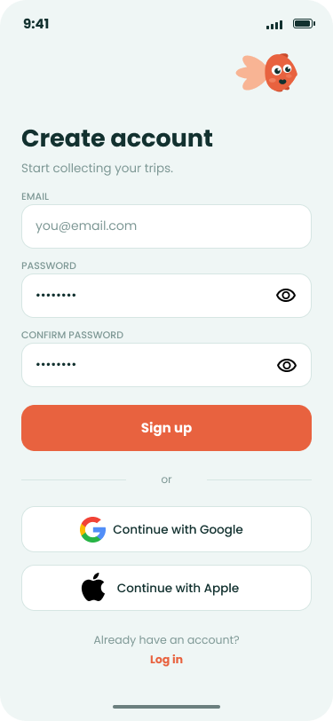</td>
<td width="20%">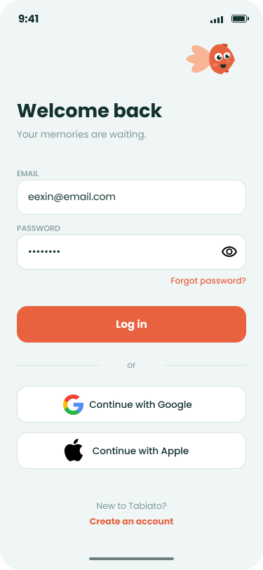</td>
<td width="20%">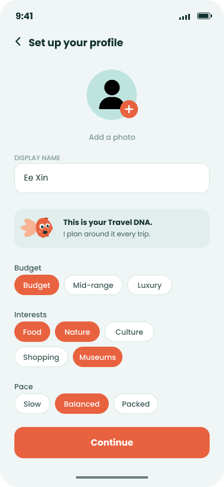</td>
<td width="20%">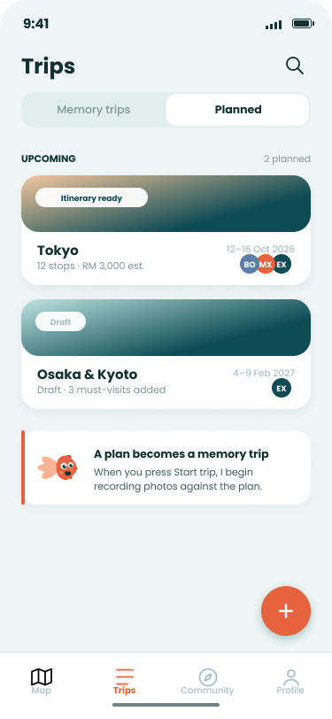</td>
</tr>
<tr>
<td valign="top"><sub><b>Splash</b></sub></td>
<td valign="top"><sub><b>Sign up</b></sub></td>
<td valign="top"><sub><b>Login</b></sub></td>
<td valign="top"><sub><b>Profile setup.</b> The short version that survived — the long "Travel DNA"
questionnaire was cut on mentor advice.</sub></td>
<td valign="top"><sub><b>Planned trips.</b> The other tab of the trips list. A plan becomes a
memory trip when you press Start.</sub></td>
</tr>
<tr>
<td valign="top">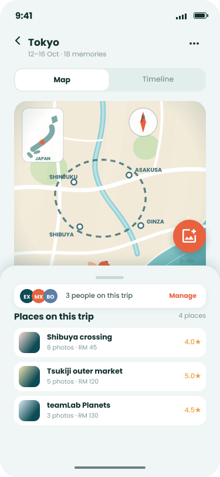</td>
<td valign="top">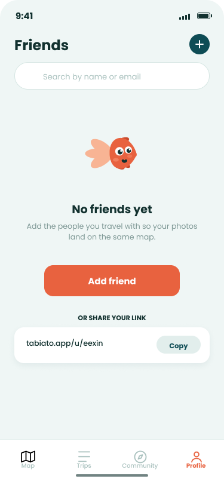</td>
<td valign="top">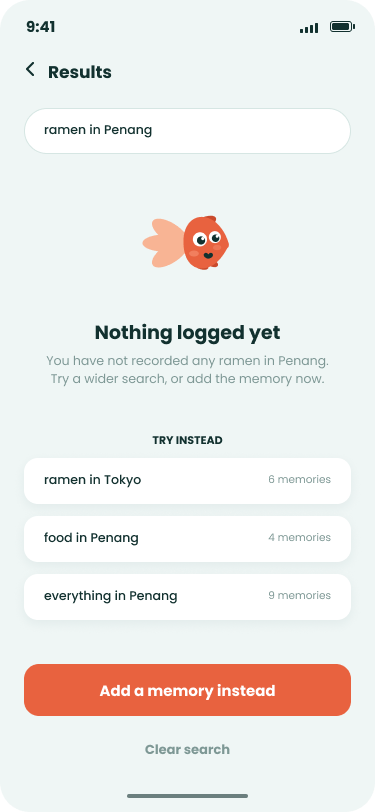</td>
<td valign="top">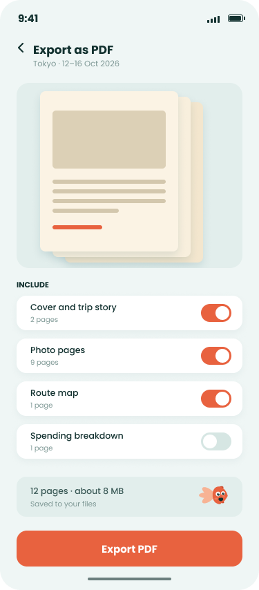</td>
<td valign="top">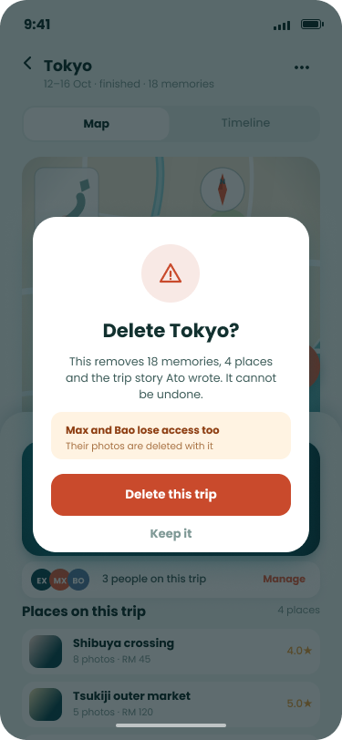</td>
</tr>
<tr>
<td valign="top"><sub><b>Trip in progress.</b> The same trip before it ends — no story card yet,
because there is nothing to write about.</sub></td>
<td valign="top"><sub><b>No friends yet.</b> Empty states point at the next action instead of
apologising.</sub></td>
<td valign="top"><sub><b>No search results.</b> Offers three wider searches and a way to record
the memory instead.</sub></td>
<td valign="top"><sub><b>Export as PDF.</b> Pick which sections go in; the page count and file
size update as you toggle.</sub></td>
<td valign="top"><sub><b>Delete trip.</b> Names the cost — 18 memories, 4 places, the story Ato
wrote — and warns that the other members lose access too.</sub></td>
</tr>
</table>

**50 screens in total**, including every loading, empty, confirmation and overlay state in the
flows above.

---

## 3. Ideation & Process

### 3.1 Ideas We Considered

We swept wide across both Lifestyle problem statements before narrowing to three serious
candidates, then judged those three against the same four questions. The axes are not invented
for this document — they are the angles our mentors actually attacked us from.

| | Where does the data come from? | Fit to the problem statement | Buildable in one month? | Already solved elsewhere? |
| --- | --- | --- | --- | --- |
| **Memory Trip** | **Photos the user already takes.** GPS and timestamp are read automatically; everything else is optional. Zero-effort input is the whole reason this survived. | Sits *after* the trip, which a mentor flagged as outside the stated scope. We kept it and closed the gap by making the record feed the next itinerary. | Yes. The hard part is EXIF parsing and clustering, both well-trodden. | Partly. Shared albums pin photos to a map, but none of them hold spend, ratings and group comments per place, or use any of it to plan. |
| **AI Adaptive Travel System** | Trip data the app itself generates, plus weather and opening-hours APIs. Light input burden. | Direct hit — it *is* a travel planner. | Mostly. Live crowd data turned out to have no official API, so that piece was cut. | **Heavily.** Google and ChatGPT already generate itineraries; three mentors independently called the category saturated. |
| **AI Personal Life Management** | **The user must type everything in** — tasks, energy, focus, mental load. | Direct hit on the Stress & Workload statement. | Technically yes, but it fails before that: it needs weeks of logged data before producing any value. | Yes, and well. Task and calendar managers are mature products. |

**The verdict.** Adaptive Travel System was the safest fit and the weakest differentiator. Life
Management was a clean fit and an unbuildable one — a tool meant to reduce a stressed person's
workload that begins by adding to it. Memory Trip was the only candidate that scored well on the
input question, which is the question that actually decides whether an app survives contact with
real users. Its one weakness — scope fit — was fixable by wiring the memory back into planning.
So we kept Memory Trip as the core, folded Adaptive Travel System in as the planner layer, and
dropped Life Management entirely.

**Every idea we generated, chosen ones first:**

| Idea | Why it was kept / dropped |
| --- | --- |
| **Memory Trip** *(Chosen — the core)* | Records a trip as structured, shared memory and turns it into an AI story that personalises the next trip. Kept because it was the only idea where the *after* phase produced lasting value, and because it gave the AI real data to reason about instead of guesses. |
| **AI Adaptive Travel System** *(Chosen — demoted to the planner layer)* | Itinerary generation plus real-time replanning on weather, hours and fatigue. Kept but demoted: it answers "how do I move through this trip well?", the smaller half of the problem. Merged in rather than dropped, because it is where trip data originates. |
| **AI Personal Life Management** *(Dropped)* | Life as a resource system — tasks, energy, focus, mental load. Dropped on feasibility: everything it needs must be typed in, which is a lot of work before any value appears, and daily-logging apps see steep drop-off after a week. Two mentors raised this independently. |
| Trip Negotiator | Group conflict resolution with a fairness score. Dropped as a product; the scoring is not objectively definable. Survives in reduced form as the Group Preference Board. |
| Trip DNA | A travel personality built from natural language instead of checkboxes. Dropped as a product because it is a feature, not an app. Survives as the travel profile. |
| Sidebar | Put the AI inside the group chat people already use, so nobody installs anything. Strong on adoption, dropped on feasibility — parsing real group-chat chaos was beyond a one-month build. |
| Trip Director | Real-time adaptive itinerary as the headline. Dropped: overlapped almost entirely with the Adaptive Travel System. |
| Second Brain | Capture everything in your head, sort it into tasks, decisions and open loops. Dropped with the stress track; the name is also a crowded category. |
| Energy Market | Daily energy as a currency you spend and recover. The most distinctive stress idea and the hardest to let go, but it has the same fatal input problem. |
| Life Autopilot | AI that acts for you — reschedules, drafts messages, books recovery time. Dropped for scope; the "acting" half alone exceeded a month. |

**The narrowing:** ten ideas → three serious candidates → one dropped on feasibility → the
remaining two found complementary rather than competing → merged, with one demoted to support.

### 3.2 Ideation Boards

**Problem tree — working backwards from the symptom**

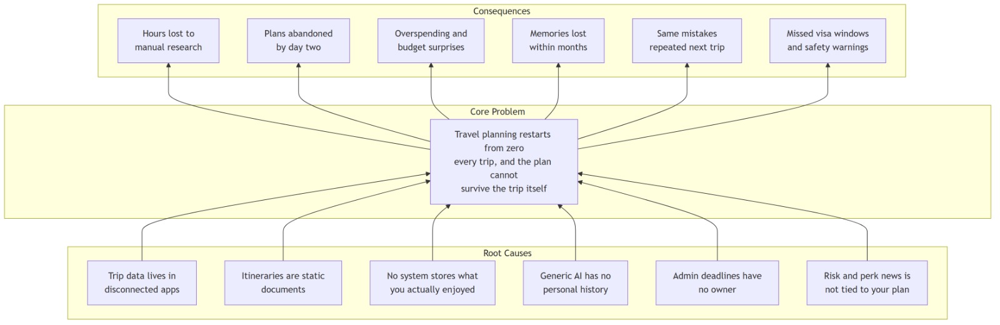

Core problem in the middle, causes below, consequences above. This diagram is what moved us from
"build a planner" to "build memory" — four of the six root causes are about what happens *after* a
trip, not before it.

**Product lifecycle — the loop the app is built around**

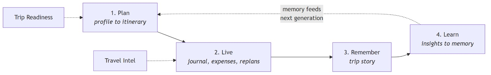

Plan → Live → Remember → Learn, with Learn feeding back into Plan. That return arrow is the whole
argument; without it this is another itinerary generator.

**Feature mindmap — the full universe, before we cut it**

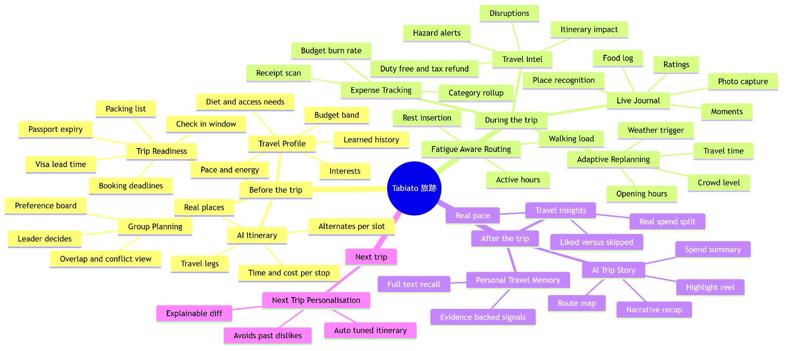

We mapped more than we could build so the cuts would be decisions rather than omissions. Most of
*During* and *After* survived; much of *Before* was demoted into the optional planner.

**User flow — the built spec**

Cut into component journeys so each is readable. Full version:
[`flow-00-full-userflow.png`](docs/assets/flow-00-full-userflow.png) · editable source:
[`Tabiato.drawio`](docs/assets/Tabiato.drawio)

<table>
<tr>
<td width="50%" valign="top">

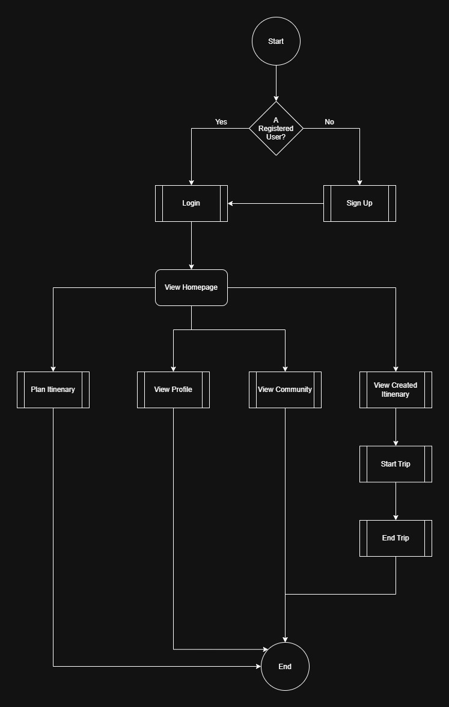

**Entry and navigation.** A registered user lands on the memory map; everything branches from
there.

</td>
<td width="50%" valign="top">

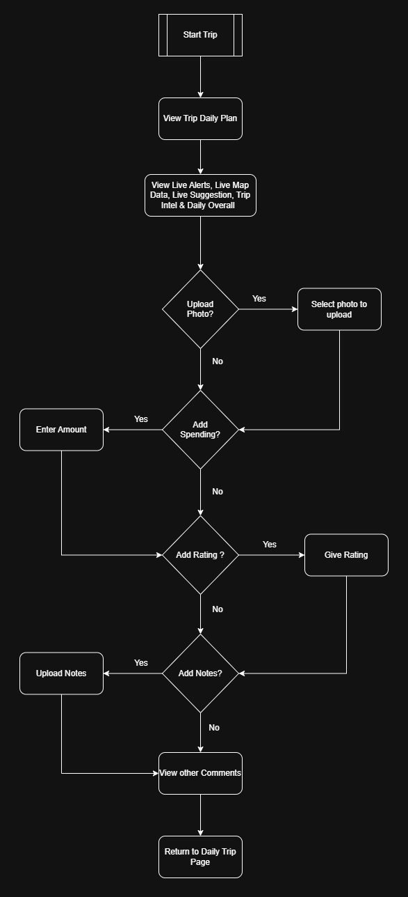

**The core loop.** Upload, then optionally attach spend, rating and notes — each a separate
opt-in, never one long form.

</td>
</tr>
<tr>
<td width="50%" valign="top">

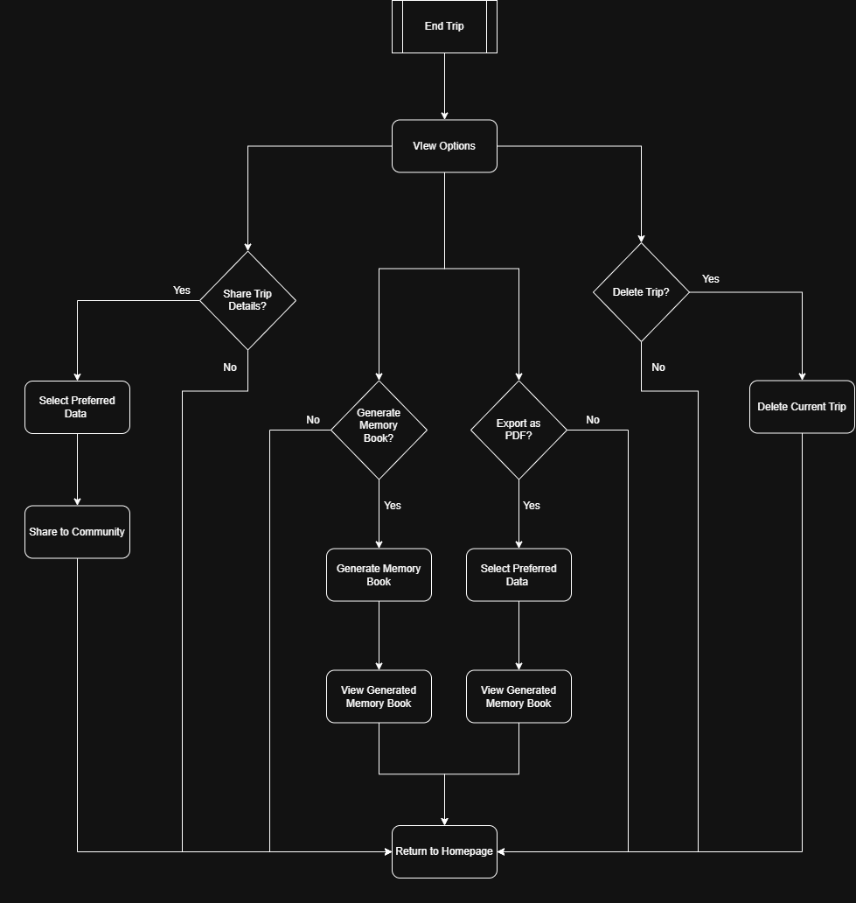

**Ending a trip.** Memory book, share, export and delete all branch from one options sheet.

</td>
<td width="50%" valign="top">

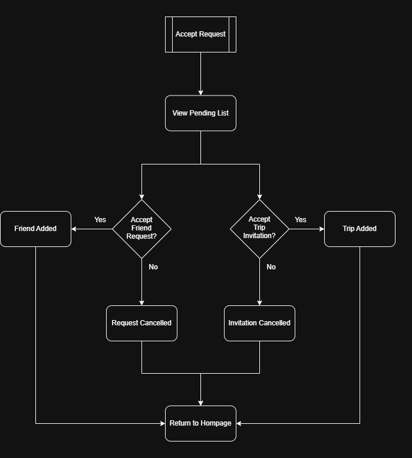

**Friends and trip invitations.** Requests and trip invites resolve through the same structure.

</td>
</tr>
</table>

Remaining journeys: [sign up](docs/assets/flow-02-signup.png) ·
[login](docs/assets/flow-03-login.png) ·
[plan a trip](docs/assets/flow-04-plan-trip.png) ·
[view itinerary](docs/assets/flow-05-view-itinerary.png) ·
[profile](docs/assets/flow-08-profile.png) ·
[community](docs/assets/flow-09-community.png) ·
[friend list](docs/assets/flow-11-friend-list.png)

### 3.3 Mentor Consultation

Four mentors over six days. The feedback changed the product substantially — it is the reason the
planner is a secondary feature rather than the headline.

**Jarod Tan — 2 September 2026**

| Feedback received | What was changed |
| --- | --- |
| The only reliable way to get data for the stress concept is for users to key it in, and stressed users will not. Gamifying data entry will not fix that. | Treated as structural, not a design problem. Became a key reason to drop the Stress/Workload concept rather than patch it. |
| "Stress & Workload Manager" is too broad; task and calendar management already has good solutions. Find a specific, genuinely painful problem with no good answer. | Agreed. Dropped the stress concept and committed to Travel. |
| Hidden-task prioritisation still depends on users entering due dates and importance — the same data problem again. | Deprioritised with the rest of the concept. |
| Liked Memory Trip but warned that expense tracking and photo sharing between companions already exist. Focus on the *shared experience* as the core value, not utility features. | Agreed, and it reshaped the pitch. Expenses and the friend system became supporting features; the headline is the shared trip record. |
| Google Maps gets expensive at scale — check OpenStreetMap first. | Partially agreed. Evaluated and chose OSM-based providers, but did not rule Google out on principle until we confirmed OSM covered what we need. |
| Asked us to confirm the itinerary logic was not simply recommending new places. | Validation, not a change — our logic already was "the user lists the places, the AI groups and orders them by proximity". We then made it explicit in the UI with the **yours** tag. |
| Use an AI orchestration tool to constrain what the AI can discuss. | Agreed. The AI sits behind a provider interface with scoped prompts and typed output contracts, not a raw general-purpose prompt. |
| Do not overload the app — a judge should be able to identify one strong, well-executed core feature. | Agreed, and it became our scoping rule. One feature gets full backend treatment; everything else is explicitly ranked below it. |
| Mobile-first makes sense; nobody opens a laptop mid-trip. | Confirmed. Built mobile-first as a PWA, desktop as a stretch goal for the planner only. |

**Khor Jia Quan — 3 September 2026**

| Feedback received | What was changed |
| --- | --- |
| Both stress ideas rely on manual input, contradicting the goal of reducing an already-stressed user's workload. | Agreed. Confirmed the decision to drop them. |
| Memory Trip is not fully novel — Google Photos shared albums with location tagging already do part of this. | Agreed, and we stopped calling it first-of-its-kind. We differentiate on what the record *is* (structured per-place data) and what it *feeds* (the next itinerary), not on the act of pinning photos to a map. |
| The problem statement is centred on trip planning. A memory-only feature sits outside the stated scope, since memories only exist during or after a trip. | **The most important feedback we received, and the one we pushed back on most carefully.** We did not drop memory; we connected it to planning. Recorded places, ratings and spend now feed the next itinerary directly, and the planner stays in the product. Our position: a planner that has read your last three trips is still a planner, and a better one. |
| A generic travel planner is saturated and should not be the headline. | Agreed. The planner is explicitly secondary in the product and in this document. |
| Fine-tuning an LLM is overengineering for one month. Use free-tier APIs. | Agreed. No fine-tuning; we filter API responses and pass only necessary fields into prompts. |
| Simplify onboarding — the "Travel DNA" questionnaire adds friction. | Agreed, partially. Cut the standalone questionnaire; a short profile step remains, and preferences are otherwise learned from behaviour. |
| Merge overlapping steps; ease of use should be a highlight. | Agreed. Upload, place detection, spend and rating merged into one flow — photos selected once, place proposed automatically, everything else optional. |

**Yeong Chiau Wen — 6 September 2026**

| Feedback received | What was changed |
| --- | --- |
| Itinerary planning is increasingly common — Google and ChatGPT already generate itineraries — so a planner alone is not novel. | Agreed. Reinforced keeping the planner secondary. |
| The map-based memory concept felt fresh but thin as a single feature. Layer more on top. | Agreed. Added the memory book, travel insights and natural-language memory search, so it is a system rather than a photo log. |
| Make recording feel rewarding, the way streaks keep people returning. | Partially agreed. Travel is not daily, so streaks do not map. The reward is deferred and larger: finishing a trip produces the memory book. |
| Batch uploaders will not fill in per-photo detail. Consider AI landmark recognition. | Agreed with the problem, different fix. Auto-grouping by GPS and time solves most of it without a vision model; landmark recognition is future work, not a hackathon promise. |
| Suggested community discovery for browsing public trips; raised a privacy risk — public location data can expose people to being followed. | Agreed on both. Community is in the prototype, and the privacy concern is answered with per-field sharing controls, notes defaulting to private. |
| Do not overload with small features; judges evaluate the demo. Keep full backend work for the core feature only. | Agreed — exactly how the build plan is structured. |
| Most teams will emphasise AI; judges may read this as "not AI enough". Add a clearly visible AI feature such as a trip recap. | Agreed, and it directly produced the AI Memory Book — now the most visible AI artefact in the product. |
| Notify users when a friend starts a trip, to bring them back between trips. | Agreed in principle; queued behind the core loop. |
| Google Maps is not free past a threshold; check APU student cloud credits. | Agreed. Confirmed the OSM stack; student credits are a fallback, not a dependency. |

**Teh Ming En — 7 September 2026**

| Feedback received | What was changed |
| --- | --- |
| Public/private community sharing is strong — a public trip lets creators share a full itinerary followers can browse or copy. | Agreed. Kept both the public-community and private-friend-group paths. |
| With 200+ teams, most will build a normal planner. Spend almost all remaining time perfecting the memory map UI. | Agreed, and it set our priority order. The memory map got the most design time by a wide margin. |
| Consider going further — drop forward-looking planning entirely and reframe as a "trip memories planner" organising memories into a Day 1 / Day 2 / Day 3 story. | Partially agreed. We leaned into the framing but kept a lightweight planner, since the problem statement is Travel Planner and removing planning entirely would put us outside it. The Day 1 / Day 2 structure was adopted for the timeline and the memory book. |
| If location services are off there is no metadata, and the map's story breaks silently. Force manual location input as a backup. | Agreed and implemented as a rule: when GPS is missing we ask, and never infer from a neighbouring photo. |
| An AI recap *video* may not be novel — iPhone Photos already does it, and video is expensive. A text itinerary is cheaper and more shareable. | Agreed, and it changed the output format. The Memory Book is text and photos, not video: cheaper, faster to demo, readable as a shareable itinerary. |
| Avoid feature bloat; group smaller features as "additional" after the core is realised. | Agreed, consistent with the other mentors and reflected in the build plan. |
| Develop a mascot aligned with the app's feel. Jokingly suggested a goldfish, playing on the "7-second memory" trope as an ironic contrast to a memory app. | Agreed, and we took the joke seriously. **Ato**, a goldfish, is now the mascot and the voice of every AI output. The fish that supposedly forgets everything is the one that remembers your trips. |
| The map should not look like a default Google Maps embed. It needs a distinctive style so the map itself feels worth using. | Agreed. We built a custom **Water World** theme — real map geometry, coastlines, rail lines and district labels preserved, with light rays, seabed, coral and drifting fish layered as atmosphere. |

---

## 4. What Makes It Different

**1. The unit of memory is a place, not a photo.**
Photo apps store images with coordinates attached. Tabiato stores *a place you visited*, carrying
the money spent there, the rating you gave it, your note, and the comments of the people who were
with you. You cannot compute a spend split, a rating pattern, or a personalised itinerary from a
folder of images. Every item below depends on this one.

**2. Four camera rolls become one trip.**
Because a place record accepts contributions from multiple members, a group trip produces a single
account of what happened rather than four partial ones. Shared albums merge *photos*. Tabiato
merges *the trip* — the bill, the rating and the conversation, attached to the place they belong
to.

**3. The memory book explains you to yourself.**
Auto-generated photo books exist. Ours interprets: it reads the record and surfaces patterns the
user never stated — *"every stop you rated 5★ was one you arrived at before 9am"*, *"you moved
slower than planned and rated it higher for it."* It is analysis wearing the format of a keepsake.

**4. Recording never becomes a chore.**
The only required input is selecting photos. Place, time and grouping are derived; spend, rating
and notes are optional attachments you can add later or never. This is the difference between a
journalling app people abandon and one that still has data in it six months later.

**5. The planner works for you, not over you.**
Most AI planners recommend places. Ours starts from the list *you* made, locks it, and plans
around it — the itinerary even marks which stops are yours. The AI does ordering, timing and
gap-filling, which is the part humans are genuinely bad at.

**6. Alerts are matched to your itinerary, not broadcast.**
"Day four, teamLab closes early and the gardens are outdoors — swap with Day five, which is all
indoors" is a decision. A typhoon warning is a news item. We map alerts against your actual stops
by place and date, then offer the specific fix.

**7. Group conflict is surfaced, not solved.**
Our first design scored a "fair" itinerary algorithmically. We removed it: in real group trips
someone leads anyway, and objective fairness is not definable. Naming the conflict and handing the
decision to the leader is more honest and more useful.

<table>
<tr>
<td width="30%">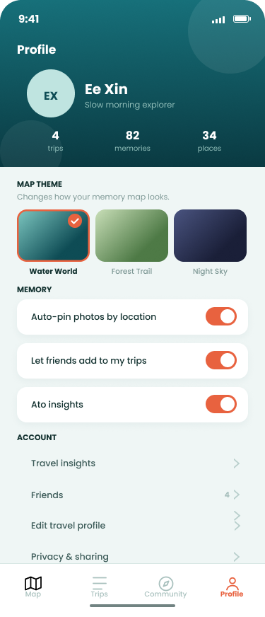</td>
<td width="70%" valign="top">

**Map themes.** A mentor told us the map must not look like a default embed, or the app has no
reason to be looked at twice. So the map is a designed surface: real geometry, coastlines, rail
lines and district labels preserved, with light rays, a seabed, coral and drifting fish layered
on top as atmosphere. **Water World** is the default; the theme is switchable from the profile,
and the goldfish swims through whichever one you pick.

</td>
</tr>
</table>

**8. The mascot is the AI's voice.**
Every AI output — the replan, the insight, the memory book — is delivered by Ato, a goldfish.
Choosing the animal whose memory is proverbially seven seconds long, for an app about remembering,
is a joke we committed to. It also does real work: a consistent, non-threatening voice matters
when the app is telling you that you overspent.

---

## 5. Technical Architecture & Feasibility

### Tech stack

**Constraint: this has to be built for RM0.** Everything below is free-tier or open source, and
each sits behind a provider interface so a paid upgrade is a config change, not a rewrite.

| Layer | Choice | Why this, and what it costs us |
| --- | --- | --- |
| Frontend | **Next.js (App Router) + TypeScript**, installable **PWA** | Mobile-first, because nobody opens a laptop mid-trip. A PWA gives the phone experience without app-store review, and the same codebase serves the desktop planner — the one part people *do* use on a computer. Trade-off: no native photo-library integration, so uploads go through the file picker. |
| UI | Tailwind CSS + shadcn/ui | Accessible primitives, fast to build. Our Figma design system maps onto it directly. |
| Map | **MapLibre GL JS** + OpenFreeMap tiles, custom style | The Water World theme needs real style control — custom sprites, patterns, layer colours. MapLibre supports all of it and the tile endpoint has no request cap. Google Maps was rejected here specifically: its cloud styling only recolours existing layers, so our theme is not buildable on it. |
| Photo metadata | **exifr**, client-side | Reads GPS and timestamp in the browser before upload, so we never pay to process a photo we would reject. |
| Place naming | **Nominatim** reverse geocoding, cached | Turns coordinates into a place name. Hard 1 req/sec policy, so we batch per upload session and cache aggressively; a repeat location costs zero requests. |
| POI data | **Overpass API** over OpenStreetMap, cached to Postgres | Powers must-visit search and itinerary gap-filling. Queried once per city, then served from our own database. |
| Routing | **OpenRouteService** free tier | One distance-matrix call covers a city's cached POIs, so re-ordering a day afterwards costs no network calls. |
| Backend | Next.js Route Handlers + Server Actions | One deployable. With four people and a month, a separate API service is overhead we cannot justify. |
| Database | **Supabase Postgres** (free tier) | Row-level security is the reason. Shared trips mean one person's photos must be visible to trip members and nobody else — RLS enforces that at the database, not in application code. |
| Auth | Supabase Auth | Email plus Google and Apple, matching the prototype, wired to the same RLS policies. |
| Photo storage | Supabase Storage (1 GB free) | Client-side compression before upload; the demo dataset is capped deliberately. This is our tightest ceiling and we know it. |
| LLM (text) | **Groq** free tier, open-weight models | Memory book, insights, itinerary ordering. Fast enough that generation feels live on stage. Output cached by prompt hash, so re-running the demo costs nothing and cannot be broken by a rate limit. |
| Weather | **Open-Meteo** | Free, no key. Drives the replanning trigger. |
| Hazard alerts | **GDACS**, **USGS** | Official feeds, free, no key. The source behind Travel Alert. |
| Currency | **Frankfurter** (ECB rates) | Normalises expenses when a trip crosses currencies. |
| Hosting / CI | Vercel Hobby + GitHub Actions | Zero-config deploys, preview URL per pull request, lint and typecheck on push. |

### System architecture

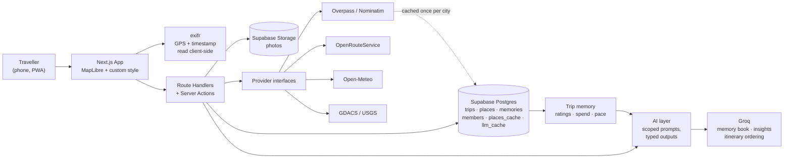
```mermaid
flowchart LR
    U["Traveller<br/>(phone, PWA)"] --> APP["Next.js App<br/>MapLibre + custom style"]
    APP --> EXIF["exifr<br/>GPS + timestamp<br/>read client-side"]
    APP --> API["Route Handlers<br/>+ Server Actions"]
    API --> DB[("Supabase Postgres<br/>trips · places · memories<br/>members · places_cache · llm_cache")]
    API --> ST[("Supabase Storage<br/>photos")]
    API --> AI["AI layer<br/>scoped prompts,<br/>typed outputs"]
    AI --> GROQ["Groq<br/>memory book · insights<br/>itinerary ordering"]
    API --> PROV["Provider interfaces"]
    PROV --> OSM["Overpass / Nominatim"]
    PROV --> ORS["OpenRouteService"]
    PROV --> WX["Open-Meteo"]
    PROV --> HAZ["GDACS / USGS"]
    OSM -.->|cached once per city| DB
    DB --> MEM["Trip memory<br/>ratings · spend · pace"]
    MEM --> AI
```

The dotted line is the point of the design: external data is fetched once, then owned. After day
one the app runs off its own database and cannot be broken by someone else's rate limit.

### Build plan & scope

Four people, roughly one month. Deliberately narrow, and ordered so that if we run out of time we
lose the least important thing.

**Tier 1 — full stack, database-backed. This is the demo.**

- Auth, profile, friends
- Create a memory trip, invite members, RLS-enforced shared access
- Photo upload with EXIF GPS and timestamp extraction, clustering into places, mandatory manual
  location entry when metadata is absent
- Location detail: photos, spend, rating, notes, comments
- Trip map view and trip timeline
- AI Memory Book generation from the trip record
- Travel insights written back to the profile

**Tier 2 — full stack, built after Tier 1 is solid.**

- Planner: must-visit list, AI itinerary generation and ordering, day totals
- Group preference board
- Memory search over your own records

**Tier 3 — front-end with seeded data for the demo; real build only if time allows.**

- Community feed, public trip view, per-field sharing controls
- Travel alerts and trip intel, including itinerary impact mapping
- Export as PDF

**Explicitly not building this round:** AI landmark recognition as a metadata fallback, live crowd
data, push notifications, native apps.

### Honest limitations

Stated up front, because a judge will ask.

- **Place recognition is EXIF-based, not visual.** If a photo has no GPS we ask rather than guess
  — correct behaviour, but it adds a step. Vision-based landmark recognition is future work, not a
  promise for this round.
- **Free-tier ceilings are real.** Nominatim is 1 request per second, Supabase Storage is 1 GB,
  Groq has a per-minute cap. Our answer is caching and a capped demo dataset, not a claim that
  this scales as-is.
- **No third-party ratings or review counts.** OpenStreetMap does not carry them and we are not
  scraping a review site. Ratings in Tabiato are *yours*, which is consistent with the product.
- **Community is a prototype surface this round.** Designed and specified; whether it is
  database-backed by the deadline depends on Tiers 1 and 2 finishing first.
- **Crowd-level data is not live.** There is no official public API for foot traffic, and what
  circulates publicly is scraped from a maps web page, which is unstable and against terms. Any
  crowd signal we show is labelled an estimate.

---

## Repo Structure

```
.
├── README.md              # this file — the complete submission document
└── docs
    └── assets             # ideation diagrams, user flows, UI screens
```

Application code lands in `src/` during the building phase.

---

## Attribution

Built on open data and free tiers. Attribution is a licence obligation for several of these, not a
courtesy, and is rendered in-app as well as here.

- Map and POI data © [OpenStreetMap](https://www.openstreetmap.org/copyright) contributors,
  licensed [ODbL](https://opendatacommons.org/licenses/odbl/), via
  [Overpass](https://dev.overpass-api.de/overpass-doc/en/preface/commons.html) and
  [Nominatim](https://operations.osmfoundation.org/policies/nominatim/)
- Map tiles by [OpenFreeMap](https://openfreemap.org/), rendered with
  [MapLibre GL JS](https://maplibre.org/)
- Routing by [OpenRouteService](https://openrouteservice.org/)
- Weather by [Open-Meteo](https://open-meteo.com/)
- Hazard data from [GDACS](https://gdacs.org/) and
  [USGS](https://www.usgs.gov/products/web-tools/apis)
- Exchange rates from [Frankfurter](https://frankfurter.dev/), sourced from the ECB
